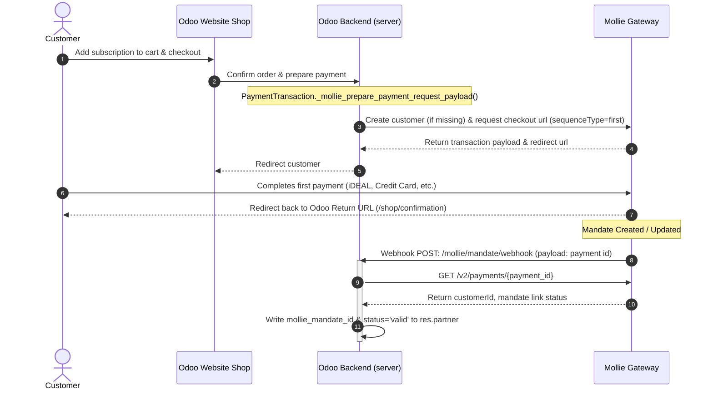
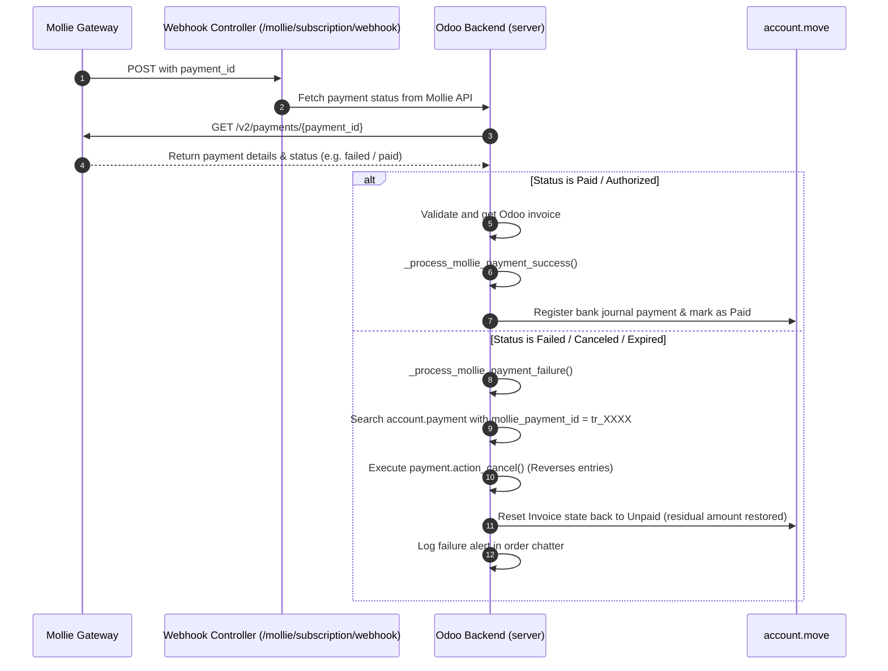

# Technical Documentation: Mollie Subscription Renewals & Recurring Payments

This document provides a comprehensive technical blueprint of the `mollie_recurring_payments` Odoo 18 module. It is intended for Odoo developers, system architects, and technical administrators.

---

## 1. Architecture Blueprint & Class Relationships

The `mollie_recurring_payments` module extends Odoo 18's native core models, accounting modules, and standard subscription system to integrate automated recurring payment captures via the Mollie API. 

The architecture is built on a **loosely-coupled interceptor pattern**:
- Rather than replacing Odoo's native subscription workflow, the module **intercepts the native subscription renewal process**, captures payments directly via the Mollie API, and then handovers control back to Odoo to generate invoice lines.
- It then listens to asynchronous webhooks from Mollie to reconcile draft/posted invoices or reverse Odoo payments on terminal transaction failures.

### Class and Inheritance Diagram
The following Mermaid diagram shows how the custom models inherit and extend Odoo core and enterprise models:

```mermaid
classDiagram
    class ResConfigSettings {
        +Many2one mollie_recurring_company_id
    }
    class ResPartner {
        +Char mollie_customer_id
        +Char mollie_mandate_id
        +Char mollie_transaction_id
        +Char mollie_mandate_status
        +action_fetch_mollie_mandate()
    }
    class SaleOrder {
        +Char mollie_customer_id (related)
        +Char mollie_mandate_id (related)
        +Char mollie_transaction_id (related)
        +Char mollie_mandate_status (related)
        +Selection subscription_type
        +Date next_payment_date
        +Char last_payment_id
        +Char partner_email (related)
        +Char mollie_last_payment_status
        +Boolean mollie_last_payment_paid
        +Monetary mollie_last_payment_amount
        +Datetime mollie_last_payment_paid_at
        +Datetime mollie_last_payment_checked_at
        +Datetime mollie_last_payment_unpaid_since
        +Date mollie_last_charged_date
        +action_confirm()
        +action_refresh_last_mollie_payment_status()
        +_cron_recurring_create_invoice()
        +_process_mollie_payment_success()
        +_process_mollie_payment_failure()
        +_reconcile_with_mollie_payment()
        +_is_subscription_charge_blocked()
    }
    class PaymentProvider {
        +One2many mollie_voucher_ids
        +Boolean mollie_use_vouchers
        +_get_supported_payment_method_codes()
        +_mollie_ensure_giftcard_support()
    }
    class MollieVoucherConfig {
        +Many2one provider_id
        +Many2one category_id
        +Selection mollie_voucher_type
    }
    class PaymentTransaction {
        +_mollie_prepare_payment_request_payload()
    }
    class AccountMove {
        +Char mollie_last_payment_status (computed)
        +_compute_mollie_from_so()
    }
    class AccountPayment {
        +Char mollie_payment_id
    }

    ResConfigSettings <|-- "res.config.settings"
    ResPartner <|-- "res.partner"
    SaleOrder <|-- "sale.order"
    PaymentProvider <|-- "payment.provider"
    PaymentTransaction <|-- "payment.transaction"
    AccountMove <|-- "account.move"
    AccountPayment <|-- "account.payment"
    MollieVoucherConfig --> PaymentProvider : "mollie_voucher_ids"
```

---

## 2. Schema Extensions & Data Dictionary

The module introduces a new database model and extends several core models to store Mollie metadata and status flags.

### 2.1. Model: `mollie.voucher.config`
Stores configurations mapping Odoo product categories to Mollie-supported B2B voucher types.

| Field Name | Type | Description |
| :--- | :--- | :--- |
| `provider_id` | Many2one (`payment.provider`) | Reference to the Mollie payment provider (cascades on delete). |
| `category_id` | Many2one (`product.category`) | The Odoo product category to map. |
| `mollie_voucher_type` | Selection | Voucher category: `eco` (Eco), `meal` (Meal), `gift` (Gift), `sport_culture` (Sport/Culture), `holiday` (Holiday). |

### 2.2. Extended Model: `payment.provider`
Enables custom voucher behavior for the Mollie provider.

| Field Name | Type | Technical Details |
| :--- | :--- | :--- |
| `mollie_voucher_ids` | One2many (`mollie.voucher.config`) | The list of category mappings. |
| `mollie_use_vouchers` | Boolean | Activates mapping line items to the Mollie payload if enabled. |

### 2.3. Extended Model: `res.partner`
Holds customer-level Mollie mandate identifiers.

| Field Name | Type | Technical Details |
| :--- | :--- | :--- |
| `mollie_customer_id` | Char | Unique identifier generated for this partner in Mollie's system (`cst_XXXXXX`). |
| `mollie_mandate_id` | Char | Active SEPA Direct Debit mandate ID generated during checkout (`mdt_XXXXXX`). |
| `mollie_transaction_id` | Char | Reference to the first transaction ID that established the mandate. |
| `mollie_mandate_status` | Char | The status of the mandate (`valid` or False). |

### 2.4. Extended Model: `sale.order`
Houses subscription parameters, recurring billing parameters, and payment status checks.

| Field Name | Type | Technical Details |
| :--- | :--- | :--- |
| `mollie_customer_id` | Char | Related stored field (`partner_id.mollie_customer_id`) for performance index filtering. |
| `mollie_mandate_id` | Char | Related stored field (`partner_id.mollie_mandate_id`) for performance index filtering. |
| `mollie_transaction_id`| Char | Related stored field (`partner_id.mollie_transaction_id`). |
| `mollie_mandate_status`| Char | Related stored field (`partner_id.mollie_mandate_status`). |
| `subscription_type` | Selection | Frequency selection: `monthly` (Monthly), `bimonthly` (Every 2 Months). |
| `next_payment_date` | Date | The next scheduled auto-charge date. |
| `last_payment_id` | Char | The most recent Mollie payment ID charged or pending (`tr_XXXXXX`). |
| `partner_email` | Char | Related stored field (`partner_id.email`). |
| `mollie_last_payment_status` | Char | Status returned from the Mollie API (`paid`, `pending`, `failed`, `canceled`, `expired`). |
| `mollie_last_payment_paid` | Boolean | Flag indicating if the payment is active/cleared (includes `paid`, `authorized`, `pending`). |
| `mollie_last_payment_amount` | Monetary | The amount charged in the last transaction. |
| `mollie_last_payment_paid_at` | Datetime | Exact timestamp when Mollie marked the payment as paid. |
| `mollie_last_payment_checked_at` | Datetime | Timestamp of the last API check against Mollie's servers. |
| `mollie_last_payment_unpaid_since` | Datetime | Stores when the order transitioned into an unpaid state. |
| `mollie_last_charged_date` | Date | The specific `next_invoice_date` (renewal date) that was last successfully charged. Used as a safeguard against double billing. |

### 2.5. Extended Model: `account.move` (Invoice)
Exposes the payment status of the subscription order directly on the associated invoice.

| Field Name | Type | Technical Details |
| :--- | :--- | :--- |
| `mollie_last_payment_status` | Char | Computed field that bubbles up `sale_order.mollie_last_payment_status` via linked invoice lines. |

### 2.6. Extended Model: `account.payment`
Marks Odoo payment journal logs with their Mollie identifiers.

| Field Name | Type | Technical Details |
| :--- | :--- | :--- |
| `mollie_payment_id` | Char | Indexes and tags the Odoo payment record to avoid duplicate registry matches. |

---

## 3. Transaction & Payment Workflows

The module orchestrates three main workflows to automate subscription billing.

### 3.1. First Payment & Mandate Capture Workflow
When a customer purchases a subscription product online, their first payment creates a customer ID and registers a payment mandate on Mollie's servers.



### 3.2. Automated Recurring Charges Workflow
Running daily, this cron processes payments for subscription products that are due, then bills and reconciles them.

```mermaid
flowchart TD
    A([Start: Native Subscription Cron]) --> B{Search due orders today}
    B -- No orders --> C([End Cron])
    B -- Found Orders --> D{Filter orders with valid mandate status}
    
    D -- No active mandate --> E[Standard Odoo processes B2B invoice generation]
    D -- Has mandate --> F[Check: _is_subscription_charge_blocked?]
    
    F -- Blocked stage/end-date --> G[Skip order charge]
    F -- Allowed --> H{Is mollie_last_charged_date == today?}
    
    H -- Yes, already charged --> G
    H -- No --> I[Generate Idempotency Key]
    I --> J[API POST: /v2/payments with sequenceType=recurring]
    
    J --> K{HTTP Response Code?}
    K -- 429 Rate Limit --> L[Sleep based on Retry-After & Retry]
    K -- 200/201 Success --> M[Write payment ID & status to sale.order]
    K -- Errors --> N[Log failure to order chatter]
    
    M --> O[Call super() standard invoice cron]
    O --> P[Generate Odoo Invoice in Draft/Posted]
    P --> Q[Call Savepoint-Protected _reconcile_with_mollie_payment()]
    Q --> R[Register payment natively via account.payment.register]
    R --> S[Invoice marked as Paid / Tagged with payment ID]
```

### 3.3. Webhook & Reversal Workflow
Ensures real-time reconciliation updates and cleans up payment ledger logs if a payment fails down the line (common with asynchronous SEPA Direct Debits).



---

## 4. Deep-Dive Code Explanations & Core Mechanics

### 4.1. Idempotency Safeguards
To guarantee that a customer is never billed twice for the same subscription renewal on a given day (even if the cron job is run multiple times or interrupted mid-execution), the module creates a unique **Idempotency Key**:
```python
idempotency_key = f"mollie-charge-{order.id}-{today.isoformat()}"
```
This key is sent in the header of the Mollie request:
```python
headers["Idempotency-Key"] = idempotency_key
```
If Mollie receives two requests with the same `Idempotency-Key` within 24 hours, it ignores the second request and returns the details of the first, preventing duplicate bank charges.

### 4.2. Mollie Rate Limit (HTTP 429) & Retry Engine
The Mollie API enforces strict rate limits. To handle this, the module implements an exponential back-off retry loop in `_mollie_api_request` that checks for rate limit responses:
```python
if response.status_code == 429:
    retry_after = response.headers.get("Retry-After")
    try:
        wait_seconds = int(retry_after) if retry_after else 60
    except Exception:
        wait_seconds = 60
    time.sleep(wait_seconds)
```
The connection retries up to 3 times before failing, preventing temporary rate limits from disrupting billing schedules.

### 4.3. Safe-Charge Guard System
To prevent billing paused, canceled, or closed subscriptions, the module runs a strict runtime safety check via `_is_subscription_charge_blocked()`. This method checks for block keywords in several default and custom fields:
```python
blocked_boolean_fields = ["is_paused", "paused", "subscription_paused", "to_close", "is_closed"]
blocked_text_fields = ["subscription_state", "subscription_status", "stage_category", "state"]
```
It also verifies the subscription end dates:
```python
today = fields.Date.today()
for field_name in ["end_date", "date_end"]:
    if field_name in self._fields and self[field_name] and self[field_name] <= today:
        return True
```
This multi-layered check protects merchants from charging customers who have already opted out.

### 4.4. Voucher Precision Rounding Correction
When vouchers are used, Mollie requires that the sum of line items matches the total checkout amount exactly. However, rounding differences between Odoo's internal tax computations and Mollie's lines validation can sometimes cause a `0.01` discrepancy.

To resolve this, the module recalculates line totals and adds any remaining difference to the last line item:
```python
expected_total = float(payload['amount']['value'])
lines_total = sum(float(l['totalAmount']['value']) for l in lines)
diff = round(expected_total - lines_total, 2)
if diff != 0.0 and len(lines) > 0:
    last_line = lines[-1]
    new_total = round(float(last_line['totalAmount']['value']) + diff, 2)
    last_line['totalAmount']['value'] = f"{new_total:.2f}"
    last_line['unitPrice']['value'] = f"{new_total:.2f}"
```
This correction ensures that Odoo invoices pass Mollie's strict payload checks without errors.

### 4.5. Odoo Enterprise Bug Patch
In Odoo Enterprise, the native `_subscription_post_success_free_renewal` method can sometimes cause a multi-record singleton error if multiple free renewals process at the same time. The module patches this behavior by forcing a per-record iteration loop:
```python
def _subscription_post_success_free_renewal(self):
    for order in self:
        try:
            super(SaleOrder, order)._subscription_post_success_free_renewal()
        except Exception:
            _logger.exception("⚠️ _subscription_post_success_free_renewal failed for order %s", order.name)
```
This loop ensures that individual record failures do not disrupt the entire batch.

### 4.6. Native Reconciliations via the Odoo Payments Register Wizard
To keep the accounting ledger clean and ensure compatibility with Odoo's multi-company features, the module processes payments using the native `account.payment.register` wizard instead of writing directly to the database:
```python
payment_register = self.env['account.payment.register'].with_company(invoice_company).with_context(
    active_model='account.move',
    active_ids=invoice.ids,
).sudo().create({
    'payment_date': fields.Date.context_today(self),
    'amount': pay_amount,
    'journal_id': journal.id,
    'payment_method_line_id': payment_method_line.id,
})
payments = payment_register._create_payments()
```
This standard approach ensures that cash, outstanding receipts transit accounts, and general ledger journal entries reconcile correctly across all charts of accounts.

---

## 5. API Webhooks & Routing Specifications

The module exposes three public web endpoints to handle real-time callbacks from Mollie.

### 5.1. Route: `/mollie/mandate/webhook`
* **Type**: `json`
* **Method**: `POST`
* **Authentication**: `public` (CSRF disabled)
* **Behavior**:
  - Receives the payload: `{"id": "tr_XXXXXX"}`.
  - Queries Mollie's `/v2/payments/{payment_id}` to retrieve customer and mandate details.
  - Extracts the mandate identifier from the `_links.mandate.href` header.
  - Matches the partner using `mollie_customer_id` and saves the valid mandate ID locally.

### 5.2. Route: `/mollie/subscription/webhook`
* **Type**: `http`
* **Method**: `POST`
* **Authentication**: `public` (CSRF disabled)
* **Behavior**:
  - Handles the form-encoded payload: `id=tr_XXXXXX`.
  - Verifies the transaction details directly with Mollie's API.
  - Matches the corresponding Odoo sales order using:
    1. The stored `last_payment_id` field.
    2. The `order_id` in Mollie's transaction metadata (used as a fallback match).
  - Calls `order.action_refresh_last_mollie_payment_status()` to process payment success or failure logic.

### 5.3. Route: `/mollie/mandate/return`
* **Type**: `http`
* **Method**: `GET`
* **Authentication**: `public`
* **Behavior**:
  - Standard customer return route that redirects users back to Odoo's default checkout confirmation page (`/shop/confirmation`).

---

## 6. Cron Jobs & Scheduled Actions

The module configures background processes to keep payment statuses up to date.

### 6.1. Cron: `Mollie: Refresh Last Payment Status`
* **Identifier**: `cron_mollie_refresh_last_payment_status`
* **Model**: `sale.order`
* **Method**: `cron_refresh_mollie_last_payment_status`
* **Frequency**: Every 5 minutes
* **Technical Domain Filter**:
  ```python
  domain = [
      ("last_payment_id", "!=", False),
      ("state", "in", ["sale", "done"]),
      "|",
          ("mollie_last_payment_status", "not in", ["paid", "failed", "canceled", "expired"]),
          "|",
              "&", ("mollie_last_payment_status", "=", "paid"), ("mollie_last_payment_amount", "=", 0.0),
              ("mollie_last_payment_checked_at", ">", fields.Datetime.now() - datetime.timedelta(days=1)),
  ]
  ```
* **Purpose**: Automatically checks the status of pending payments (like SEPA Direct Debit bank transfers) and registers them in Odoo once cleared, or reverses them if they fail.

---

## 7. Testing & Quality Assurance

The module includes comprehensive unit tests in [test_mollie_subscription.py](file:///Users/alihassan/Documents/Github/mollie_recurring_payments/tests/test_mollie_subscription.py) to verify the core payment logic.

### 7.1. Running the Test Suite
You can execute the test suite from your terminal with the following command:
```bash
./odoo-bin -c <your_config_file> -i mollie_recurring_payments --test-tags=post_install,at_install
```

### 7.2. Test Cases Covered
* **`test_process_mollie_payment_success`**:
  - Creates a mock partner and subscription product.
  - Confirms a sales order and posts a draft invoice (validating the `'not_paid'` state).
  - Triggers the `_process_mollie_payment_success` routine.
  - Verifies that the invoice is updated to `'paid'`, residual amounts balance to zero, and the associated payment journal entry links back to the original sales order.
